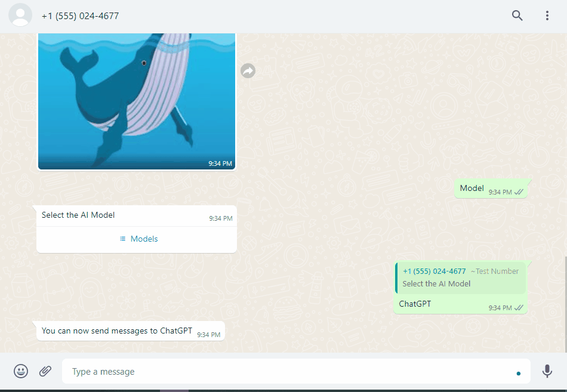

# WhatsApp Dalle Whisper GPT bot


## How it works
A conversational, voice-enabled, multilingual WhatsApp bot that can generate both text and image responses using APIMatic auto-generated SDKs for [WhatsApp](https://www.apimatic.io/apidocs/whatsapp-api/v/1_0#/http/guides/send-a-message)and [OpenAI](https://www.apimatic.io/api-docs/openai) APIs.

`Language` and `Model` are the two reserved words that the user can send to the bot for switching between desired language and AI model.

## Running Locally

### Cloning the repository the local machine.

```bash
git clone https://github.com/mehnoorsiddiqui/whatsapp-dalle-whisper-gpt-bot
```

### Creating a account on Meta to get an API key.

1. Go to [Meta](https://developers.facebook.com/) to make a developer account.
2. Create an App by following the [getting started guide](https://developers.facebook.com/docs/whatsapp/cloud-api/get-started).
3. You can find your Access token from the Meta for Developers site App `Dashboard > WhatsApp > Getting Started`.

### Creating an OpenAI account to get an API key.
1. Go to the [OpenAI](https://openai.com/) website and sign up by filling out the registration form. 
2. Navigate to the `API keys` tab in your dashboard and generate a new API key.
### Setting up Webhook URL

To set up webhook on the Meta Developer portal (also enter matching verify token). You may use a service like [ngrok](https://ngrok.com/) to make your local app publicly accessible so this webhook can be registered with Whatsapp.
[]

### Setting up the .env file
- Rename the .env.example to .env.
- Replace the `WHATSAPP_TOKEN` with your token in the .env file.
- Replace the `PHONE_NUMBER_ID` with yours in the .env file.
- Replace the `VERIFY_TOKEN` with yours in the .env file.
- Replace the `OPENAI_API_KEY` with yours in the .env file.

### Installing the dependencies.
1. Navigate to the OpenAI+API directory and run 
```bash
npm install
```
2. Navigate to the WhatsApp+Cloud+API directory and run 
```bash
npm install
```
3. Navigate to the root folder and run 
```bash
npm install
```

### Running the application.

Then, run the application in the command line and it can be tested by sending an audio message to test number given in the developer account.

```bash
npm start
```

